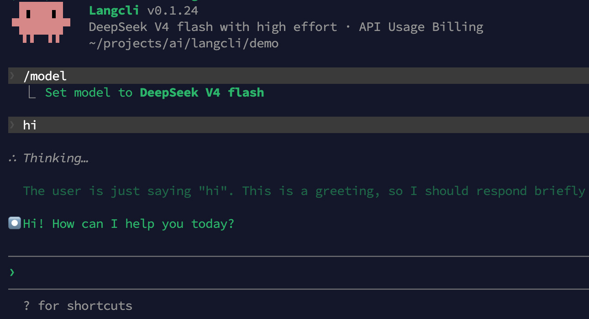

# Langcli

<div align="center">

[English](./README.md) | [简体中文](./docs/README_zh.md)

</div>

Langcli is an interactive AI coding assistant in the terminal, built upon the best practices of Claude Code. It features:
- Langcli is 100% compatible with Claude Code. Therefore, the way to use Langcli is exactly the same as that of standard Claude Code and your existing projects' .claude/skills are all applicable to Langcli. 
- Even more exciting is that Langcli is deeply integrated with [LangRouter](https://langrouter.ai/),
allowing you to friendly use and switch between mainstream LLM models (including Claude OPUS 4.6, Deepseek v4 flash, Deepseek v4 pro, GLM 5.1, Kimi K2.6, Minimax M2.5, etc.) within an ongoing session as needed, without interrupting your context.

<div align="center">
  
</div>

## Installation

### Quick Install (Recommended)

#### Linux / macOS

```bash
bash -c "$(curl -fsSL https://assets.langcli.com/installation/install-langcli.sh)"
```

#### Windows (Run as Administrator CMD)

```cmd
cmd /c "curl -fsSL -o %TEMP%\install-langcli.bat https://assets.langcli.com/installation/install-langcli.bat && %TEMP%\install-langcli.bat"
```

> **Note**: It's recommended to restart your terminal after installation to ensure environment variables take effect.

### Manual Installation

#### Prerequisites

Make sure you have Node.js 20 or later installed. Download it from [nodejs.org](https://nodejs.org/en/download).

#### NPM

```bash
npm i -g langcli-com
```

## Quick Start

#### LangRouter API Key Preparation
 Go to [LangRouter](https://langrouter.ai/), register an account, save your API key.

#### Running
```bash
# Start Langcli (interactive)
langcli

# Then, in the session:
/help
```

## Compile from source code yourself (optional)

#### Environmental requirements

- [Bun](https://bun.sh/) >= 1.3.11

#### Install dependencies

```bash
bun install
```

#### Running

```bash
# Development mode
bun run dev

# Build and run
bun run build && bun dist/cli.js
```

The built version can be started with both bun and node. You can publish to a private registry and start directly.

If you encounter any bugs, please open an issue and we will prioritize fixing them.

## Capabilities

> ✅ = Implemented  ⚠️ = Partial / Conditional  ❌ = stub / Removed / Feature flag off

### Core System

| Capability | Status | Description |
|------------|--------|-------------|
| REPL Interactive UI (Ink Terminal Rendering) | ✅ | Main screen 5000+ lines, full interaction |
| API Communication — Anthropic Direct | ✅ | Supports API Key + OAuth |
| API Communication — AWS Bedrock | ✅ | Supports credential refresh, Bearer Token |
| API Communication — Google Vertex | ✅ | Supports GCP credential refresh |
| API Communication — Azure Foundry | ✅ | Supports API Key + Azure AD |
| Streaming Conversation & Tool Call Loop (`query.ts`) | ✅ | 1700+ lines, includes auto-compaction, token tracking |
| Session Engine (`QueryEngine.ts`) | ✅ | 1300+ lines, manages conversation state and attribution |
| Context Building (git status / CLAUDE.md / memory) | ✅ | `context.ts` fully implemented |
| Permission System (plan/auto/manual modes) | ✅ | 6300+ lines, includes YOLO classifier, path validation, rule matching |
| Hook System (pre/post tool use) | ✅ | Supports settings.json configuration |
| Session Resume (`/resume`) | ✅ | Separate ResumeConversation screen |
| Doctor Diagnostics (`/doctor`) | ✅ | Version, API, plugin, sandbox checks |
| Auto Compaction | ✅ | auto-compact / micro-compact / API compact |

### Tools — Always Available

| Tool | Status | Description |
|------|--------|-------------|
| BashTool | ✅ | Shell execution, sandbox, permission checking |
| FileReadTool | ✅ | File / PDF / image / Notebook reading |
| FileEditTool | ✅ | String replacement editing + diff tracking |
| FileWriteTool | ✅ | File creation / overwrite + diff generation |
| NotebookEditTool | ✅ | Jupyter Notebook cell editing |
| AgentTool | ✅ | Sub-agent spawning (fork / async / background / remote) |
| WebFetchTool | ✅ | URL fetch → Markdown → AI summary |
| WebSearchTool | ✅ | Web search + domain filtering |
| AskUserQuestionTool | ✅ | Multi-question interactive prompts + preview |
| SendMessageTool | ✅ | Message sending (peers / teammates / mailbox) |
| SkillTool | ✅ | Slash command / Skill invocation |
| EnterPlanModeTool | ✅ | Enter plan mode |
| ExitPlanModeTool (V2) | ✅ | Exit plan mode |
| TodoWriteTool | ✅ | Todo list v1 |
| BriefTool | ✅ | Short message + attachment sending |
| TaskOutputTool | ✅ | Background task output reading |
| TaskStopTool | ✅ | Background task stop |
| ListMcpResourcesTool | ⚠️ | MCP resource list (filtered by specialTools, added under specific conditions) |
| ReadMcpResourceTool | ⚠️ | MCP resource reading (same as above) |
| SyntheticOutputTool | ⚠️ | Only created in non-interactive sessions (SDK/pipe mode) |
| CronCreateTool | ✅ | Scheduled task creation (AGENT_TRIGGERS gate removed) |
| CronDeleteTool | ✅ | Scheduled task deletion |
| CronListTool | ✅ | Scheduled task list |
| EnterWorktreeTool | ✅ | Enter Git Worktree (`isWorktreeModeEnabled()` hardcoded to true) |
| ExitWorktreeTool | ✅ | Exit Git Worktree |

### Tools — Conditionally Enabled

| Tool | Status | Enable Condition |
|------|--------|------------------|
| GlobTool | ✅ | Enabled when not embedded bfs/ugrep (enabled by default) |
| GrepTool | ✅ | Same as above |
| TaskCreateTool | ⚠️ | When `isTodoV2Enabled()` is true |
| TaskGetTool | ⚠️ | Same as above |
| TaskUpdateTool | ⚠️ | Same as above |
| TaskListTool | ⚠️ | Same as above |
| TeamCreateTool | ⚠️ | When `isAgentSwarmsEnabled()` |
| TeamDeleteTool | ⚠️ | Same as above |
| ToolSearchTool | ⚠️ | When `isToolSearchEnabledOptimistic()` |
| PowerShellTool | ⚠️ | Windows platform detection |
| LSPTool | ⚠️ | When `ENABLE_LSP_TOOL` environment variable |
| ConfigTool | ❌ | `USER_TYPE === 'ant'` (always false) |

### Tools — Feature Flag Off (All Unavailable)

| Tool | Feature Flag |
|------|--------------|
| SleepTool | `PROACTIVE` / `KAIROS` |
| RemoteTriggerTool | `AGENT_TRIGGERS_REMOTE` |
| MonitorTool | `MONITOR_TOOL` |
| SendUserFileTool | `KAIROS` |
| OverflowTestTool | `OVERFLOW_TEST_TOOL` |
| TerminalCaptureTool | `TERMINAL_PANEL` |
| WebBrowserTool | `WEB_BROWSER_TOOL` |
| SnipTool | `HISTORY_SNIP` |
| WorkflowTool | `WORKFLOW_SCRIPTS` |
| PushNotificationTool | `KAIROS` / `KAIROS_PUSH_NOTIFICATION` |
| SubscribePRTool | `KAIROS_GITHUB_WEBHOOKS` |
| ListPeersTool | `UDS_INBOX` |
| CtxInspectTool | `CONTEXT_COLLAPSE` |

### Tools — Stub / Unavailable

| Tool | Description |
|------|-------------|
| TungstenTool | ANT-ONLY stub |
| REPLTool | ANT-ONLY, `isEnabled: () => false` |
| SuggestBackgroundPRTool | ANT-ONLY, `isEnabled: () => false` |
| VerifyPlanExecutionTool | Requires `CLAUDE_CODE_VERIFY_PLAN=true` env var, and is stub |
| ReviewArtifactTool | stub, not registered in tools.ts |
| DiscoverSkillsTool | stub, not registered in tools.ts |

### Slash Commands — Available

| Command | Status | Description |
|---------|--------|-------------|
| `/add-dir` | ✅ | Add directory |
| `/advisor` | ✅ | Advisor configuration |
| `/agents` | ✅ | Agent list/management |
| `/branch` | ✅ | Branch management |
| `/btw` | ✅ | Quick note |
| `/chrome` | ✅ | Chrome integration |
| `/clear` | ✅ | Clear screen |
| `/color` | ✅ | Agent color |
| `/compact` | ✅ | Compact conversation |
| `/config` (`/settings`) | ✅ | Configuration management |
| `/context` | ✅ | Context information |
| `/copy` | ✅ | Copy last message |
| `/cost` | ✅ | Session cost |
| `/desktop` | ✅ | Claude Desktop integration |
| `/diff` | ✅ | Show diff |
| `/doctor` | ✅ | Health check |
| `/effort` | ✅ | Set effort level |
| `/exit` | ✅ | Exit |
| `/export` | ✅ | Export conversation |
| `/extra-usage` | ✅ | Extra usage information |
| `/fast` | ✅ | Toggle fast mode |
| `/feedback` | ✅ | Feedback |
| `/loop` | ✅ | Scheduled loop execution (bundled skill, can be disabled via `CLAUDE_CODE_DISABLE_CRON`) |
| `/heapdump` | ✅ | Heap dump (debugging) |
| `/help` | ✅ | Help |
| `/hooks` | ✅ | Hook management |
| `/ide` | ✅ | IDE connection |
| `/init` | ✅ | Initialize project |
| `/install-github-app` | ✅ | Install GitHub App |
| `/install-slack-app` | ✅ | Install Slack App |
| `/keybindings` | ✅ | Keybindings management |
| `/login` / `/logout` | ✅ | Login / Logout |
| `/mcp` | ✅ | MCP service management |
| `/memory` | ✅ | Memory / CLAUDE.md management |
| `/mobile` | ✅ | Mobile QR code |
| `/model` | ✅ | Model selection |
| `/output-style` | ✅ | Output style |
| `/passes` | ✅ | Referral codes |
| `/permissions` | ✅ | Permission management |
| `/plan` | ✅ | Plan mode |
| `/plugin` | ✅ | Plugin management |
| `/pr-comments` | ✅ | PR comments |
| `/privacy-settings` | ✅ | Privacy settings |
| `/rate-limit-options` | ✅ | Rate limit options |
| `/release-notes` | ✅ | Release notes |
| `/reload-plugins` | ✅ | Reload plugins |
| `/remote-env` | ✅ | Remote environment configuration |
| `/rename` | ✅ | Rename session |
| `/resume` | ✅ | Resume session |
| `/review` | ✅ | Code review (local) |
| `/ultrareview` | ✅ | Cloud review |
| `/rewind` | ✅ | Rewind conversation |
| `/sandbox-toggle` | ✅ | Toggle sandbox |
| `/security-review` | ✅ | Security review |
| `/session` | ✅ | Session information |
| `/skills` | ✅ | Skill management |
| `/stats` | ✅ | Session statistics |
| `/status` | ✅ | Status information |
| `/statusline` | ✅ | Status bar UI |
| `/stickers` | ✅ | Stickers |
| `/tasks` | ✅ | Task management |
| `/theme` | ✅ | Terminal theme |
| `/think-back` | ✅ | Year in review |
| `/upgrade` | ✅ | Upgrade CLI |
| `/usage` | ✅ | Usage information |
| `/insights` | ✅ | Usage analytics report |
| `/vim` | ✅ | Vim mode |

### Slash Commands — Feature Flag Off

| Command | Feature Flag |
|---------|-------------|
| `/voice` | `VOICE_MODE` |
| `/proactive` | `PROACTIVE` / `KAIROS` |
| `/brief` | `KAIROS` / `KAIROS_BRIEF` |
| `/assistant` | `KAIROS` |
| `/remote-control` (alias `rc`) | `BRIDGE_MODE` |
| `/remote-control-server` | `DAEMON` + `BRIDGE_MODE` |
| `/force-snip` | `HISTORY_SNIP` |
| `/workflows` | `WORKFLOW_SCRIPTS` |
| `/web-setup` | `CCR_REMOTE_SETUP` |
| `/subscribe-pr` | `KAIROS_GITHUB_WEBHOOKS` |
| `/ultraplan` | `ULTRAPLAN` |
| `/torch` | `TORCH` |
| `/peers` | `UDS_INBOX` |
| `/fork` | `FORK_SUBAGENT` |
| `/buddy` | `BUDDY` |

### Slash Commands — ANT-ONLY (Unavailable)

`/files` `/tag` `/backfill-sessions` `/break-cache` `/bughunter` `/commit` `/commit-push-pr` `/ctx_viz` `/good-claude` `/issue` `/init-verifiers` `/mock-limits` `/bridge-kick` `/version` `/reset-limits` `/onboarding` `/share` `/summary` `/teleport` `/ant-trace` `/perf-issue` `/env` `/oauth-refresh` `/debug-tool-call` `/agents-platform` `/autofix-pr`

### CLI Subcommands

| Subcommand | Status | Description |
|------------|--------|-------------|
| `claude` (default) | ✅ | Main REPL / interactive / print mode |
| `claude mcp serve/add/remove/list/get/...` | ✅ | MCP service management (7 subcommands) |
| `claude auth login/status/logout` | ✅ | Authentication management |
| `claude plugin validate/list/install/...` | ✅ | Plugin management (7 subcommands) |
| `claude setup-token` | ✅ | Long-lived token configuration |
| `claude agents` | ✅ | Agent list |
| `claude doctor` | ✅ | Health check |
| `claude update` / `upgrade` | ✅ | Auto-update |
| `claude install [target]` | ✅ | Native installation |
| `claude server` | ❌ | `DIRECT_CONNECT` flag |
| `claude ssh <host>` | ❌ | `SSH_REMOTE` flag |
| `claude open <cc-url>` | ❌ | `DIRECT_CONNECT` flag |
| `claude auto-mode` | ❌ | `TRANSCRIPT_CLASSIFIER` flag |
| `claude remote-control` | ❌ | `BRIDGE_MODE` + `DAEMON` flag |
| `claude assistant` | ❌ | `KAIROS` flag |
| `claude up/rollback/log/error/export/task/completion` | ❌ | ANT-ONLY |

### Services

| Service | Status | Description |
|---------|--------|-------------|
| API Client (`services/api/`) | ✅ | 3400+ lines, 4 providers |
| MCP (`services/mcp/`) | ✅ | 34 files, 12000+ lines |
| OAuth (`services/oauth/`) | ✅ | Full OAuth flow |
| Plugins (`services/plugins/`) | ✅ | Complete infrastructure, no built-in plugins |
| LSP (`services/lsp/`) | ⚠️ | Implementation exists, disabled by default |
| Compaction (`services/compact/`) | ✅ | auto / micro / API compaction |
| Hook System (`services/tools/toolHooks.ts`) | ✅ | pre/post tool use hooks |
| Session Memory (`services/SessionMemory/`) | ✅ | Session memory management |
| Memory Extraction (`services/extractMemories/`) | ✅ | Automatic memory extraction |
| Skill Search (`services/skillSearch/`) | ✅ | Local/remote skill search |
| Policy Limits (`services/policyLimits/`) | ✅ | Policy limit enforcement |
| Analytics / GrowthBook / Sentry | ⚠️ | Framework exists, actual sink is empty |
| Voice (`services/voice.ts`) | ❌ | `VOICE_MODE` flag off |

### Internal Packages (`packages/`)

| Package | Status | Description |
|---------|--------|-------------|
| `color-diff-napi` | ✅ | 1006 lines complete TypeScript implementation (syntax highlighting diff) |
| `audio-capture-napi` | ✅ | 151 lines complete implementation (cross-platform audio recording, using SoX/arecord) |
| `image-processor-napi` | ✅ | 125 lines complete implementation (macOS clipboard image reading, using osascript + sharp) |
| `modifiers-napi` | ✅ | 67 lines complete implementation (macOS modifier key detection, bun:ffi + CoreGraphics) |
| `url-handler-napi` | ❌ | stub, `waitForUrlEvent()` returns null |
| `@ant/claude-for-chrome-mcp` | ❌ | stub, `createServer()` returns null |
| `@ant/computer-use-mcp` | ⚠️ | Type-safe stub (265 lines, complete type definitions but functions return empty values) |
| `@ant/computer-use-input` | ✅ | 183 lines complete implementation (macOS keyboard/mouse simulation, AppleScript/JXA/CGEvent) |
| `@ant/computer-use-swift` | ✅ | 388 lines complete implementation (macOS display/app management/screenshot, JXA/screencapture) |

### Feature Flags (31, all return `false`)

`ABLATION_BASELINE` `AGENT_MEMORY_SNAPSHOT` `BG_SESSIONS` `BRIDGE_MODE` `BUDDY` `CCR_MIRROR` `CCR_REMOTE_SETUP` `CHICAGO_MCP` `COORDINATOR_MODE` `DAEMON` `DIRECT_CONNECT` `EXPERIMENTAL_SKILL_SEARCH` `FORK_SUBAGENT` `HARD_FAIL` `HISTORY_SNIP` `KAIROS` `KAIROS_BRIEF` `KAIROS_CHANNELS` `KAIROS_GITHUB_WEBHOOKS` `LODESTONE` `MCP_SKILLS` `PROACTIVE` `SSH_REMOTE` `TORCH` `TRANSCRIPT_CLASSIFIER` `UDS_INBOX` `ULTRAPLAN` `UPLOAD_USER_SETTINGS` `VOICE_MODE` `WEB_BROWSER_TOOL` `WORKFLOW_SCRIPTS`

## Project Structure

```
langcli/
├── src/
│   ├── entrypoints/
│   │   ├── cli.tsx          # Entry file (includes MACRO/feature polyfill)
│   │   └── sdk/             # SDK submodule stub
│   ├── main.tsx             # Main CLI logic (Commander definition)
│   └── types/
│       ├── global.d.ts      # Global variable/macro declarations
│       └── internal-modules.d.ts  # Internal npm package type declarations
├── packages/                # Monorepo workspace packages
│   ├── color-diff-napi/     # Complete implementation (terminal color diff)
│   ├── modifiers-napi/      # stub (macOS modifier key detection)
│   ├── audio-capture-napi/  # stub
│   ├── image-processor-napi/# stub
│   ├── url-handler-napi/    # stub
│   └── @ant/               # Anthropic internal package stubs
│       ├── claude-for-chrome-mcp/
│       ├── computer-use-mcp/
│       ├── computer-use-input/
│       └── computer-use-swift/
├── scripts/                 # Automation stub generation scripts
├── build.ts                 # Build script (Bun.build + code splitting + Node.js compatibility post-processing)
├── dist/                    # Build output (entry cli.js + ~450 chunk files)
└── package.json             # Bun workspaces monorepo configuration
```

## Technical Notes

### Runtime Polyfill

The entry file `src/entrypoints/cli.tsx` injects necessary polyfills at the top:

- `feature()` — All feature flags return `false`, skipping unimplemented branches
- `globalThis.MACRO` — Simulates build-time macro injection (VERSION, etc.)

### Monorepo

The project uses Bun workspaces to manage internal packages. Stubs that were manually placed in `node_modules/` have been migrated to `packages/`, resolved via `workspace:*`.

## Feature Flags Explained

The original Claude Code uses `feature()` from `bun:bundle` to inject feature flags at build time, controlled by A/B testing platforms like GrowthBook for gradual rollout. In this project, `feature()` is polyfilled to always return `false`, so all 30 flags below are disabled.

### Autonomous Agents

| Flag | Purpose |
|------|---------|
| `KAIROS` | Assistant mode — Long-running autonomous agent (includes brief, push notifications, file sending) |
| `KAIROS_BRIEF` | Kairos Brief — Send briefing summaries to users |
| `KAIROS_CHANNELS` | Kairos Channels — Multi-channel communication |
| `KAIROS_GITHUB_WEBHOOKS` | GitHub Webhook subscription — Real-time PR events pushed to Agent |
| `PROACTIVE` | Proactive mode — Agent actively executes tasks, includes SleepTool scheduled wakeup |
| `COORDINATOR_MODE` | Coordinator mode — Multi-agent orchestration and scheduling |
| `BUDDY` | Buddy pair programming feature |
| `FORK_SUBAGENT` | Fork sub-agent — Spawn independent sub-agent from current session |

### Remote / Distributed

| Flag | Purpose |
|------|---------|
| `BRIDGE_MODE` | Remote control bridge — Allows external clients to remotely control Claude Code |
| `DAEMON` | Daemon — Background persistent service, supports worker and supervisor |
| `BG_SESSIONS` | Background sessions — Background process management like `ps`/`logs`/`attach`/`kill`/`--bg` |
| `SSH_REMOTE` | SSH remote — `claude ssh <host>` to connect to remote host |
| `DIRECT_CONNECT` | Direct connect mode — `cc://` URL protocol, `server` command, `open` command |
| `CCR_REMOTE_SETUP` | Web-based remote setup — Configure Claude Code via browser |
| `CCR_MIRROR` | Claude Code Runtime mirror — Session state sync/replication |

### Communication

| Flag | Purpose |
|------|---------|
| `UDS_INBOX` | Unix Domain Socket inbox — Local agent-to-agent communication (`/peers`) |

### Enhanced Tools

| Flag | Purpose |
|------|---------|
| `CHICAGO_MCP` | Computer Use MCP — Computer operations (screen capture, mouse/keyboard control) |
| `WEB_BROWSER_TOOL` | Web browser tool — Embedded browser interaction in terminal |
| `VOICE_MODE` | Voice mode — Voice input/output, microphone push-to-talk |
| `WORKFLOW_SCRIPTS` | Workflow scripts — User-defined automation workflows |
| `MCP_SKILLS` | MCP-based Skill loading mechanism |

### Conversation Management

| Flag | Purpose |
|------|---------|
| `HISTORY_SNIP` | History snip — Manually snip segments from conversation history (`/force-snip`) |
| `ULTRAPLAN` | Ultra-plan — Large-scale planning for remote Agent collaboration |
| `AGENT_MEMORY_SNAPSHOT` | Agent memory snapshot — Memory snapshot during Agent runtime |

### Infrastructure / Experimental

| Flag | Purpose |
|------|---------|
| `ABLATION_BASELINE` | Scientific experiment — Baseline ablation testing, used for A/B experiment control group |
| `HARD_FAIL` | Hard fail mode — Abort on errors instead of graceful degradation |
| `TRANSCRIPT_CLASSIFIER` | Transcript classifier — `auto-mode` command, automatically analyzes and classifies conversation records |
| `UPLOAD_USER_SETTINGS` | Settings sync upload — Sync local configuration to cloud |
| `LODESTONE` | Deep link protocol handler — Jump to specific locations in Claude Code from external apps |
| `EXPERIMENTAL_SKILL_SEARCH` | Experimental skill search index |
| `TORCH` | Torch feature (specific purpose unknown, possibly some highlighting/tracking mechanism) |

## License

This project is for educational and research purposes only. All rights to Claude Code belong to [Anthropic](https://www.anthropic.com/).
